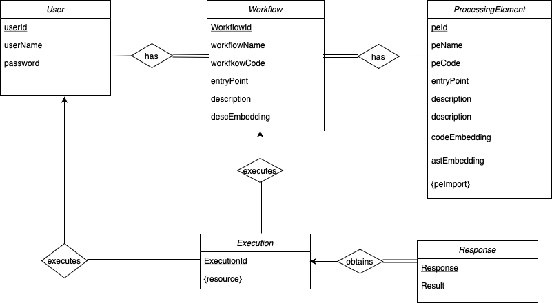

## Introduction

The Laminar Server is a core component of the Laminar framework, acting as an intermediary between the [Laminar Client](https://github.com/StreamingFlow/dispel4py-client) and the [Execution Engine](https://github.com/StreamingFlow/dispel4py-execution). It handles all communication from the client, routing requests to either the registry (MySQL database) or the execution engine as needed. When you interact with the Laminar system through the client, your requests are processed by the server, which manages and coordinates the necessary operations on your behalf.

### Laminar Server Installation and Execution
Open a new terminal with the new `Laminar` directory.
```
/data/Laminar> 
```
Clone the server application repository.
```
/data/Laminar> git clone https://github.com/StreamingFlow/dispel4py-server.git
```
Enter the server directory.
```
/data/Laminar> cd dispel4py-server
```

### Requirements (Non-Docker Installation)

If you plan to install the Laminar Server without using Docker, you need to meet the following prerequisites:

* Java 17 (JDK 17)
* MySQL Server (must be installed and running)

Additionally, you'll need to create the following MySQL database and user:

```
CREATE DATABASE laminar;
CREATE USER 'laminar'@'localhost' IDENTIFIED BY 'password';
GRANT ALL PRIVILEGES ON laminar.* TO 'laminar'@'localhost';
FLUSH PRIVILEGES;
EXIT;
```

Update the `/src/main/resources/application.properties` file with the following configuration:
```
spring.jpa.hibernate.ddl-auto=update
spring.datasource.url=jdbc:mysql://localhost:3306/laminar?useSSL=false&allowPublicKeyRetrieval=true
spring.datasource.username=laminar
spring.datasource.password=password
server.error.include-message=always
laminar.execution.url=http://localhost:5000
server.address=0.0.0.0
spring.servlet.multipart.max-file-size=1000MB
spring.servlet.multipart.max-request-size=1000MB
```

Ensure proper permissions by running:
```
/data/Laminar/dispel4py-server> chmod +x gradlew
```

To start the server
```
/data/Laminar/dispel4py-server> ./gradlew bootRun
```
The server will now be running, and ready to receive requests. You should see this sample output
```
/data/Laminar/dispel4py-server>
...
com.dispel4py.rest.RestApplication: Started RestApplication in 66.905 seconds (JVM running for 69.911)
...
```

### Docker Execution 

To run the application in a docker container follow these intstructions 


Clone the server application repository.

```
/data/Laminar> git clone https://github.com/Laminar-2/dispel4py-server.git
```
Enter the server directory.
```
/data/Laminar> cd dispel4py-server
```
Run docker compose to load up the server and database. The first time we recommend to use --build flag. 
```
docker compose up --build
```

Next time you could use:
```
docker compose up
```

If you need to rebuild the Docker containers (for instance, after making configuration changes), you can do so by following these steps:

First, bring down the running containers:
```
docker-compose down
```
Then, rebuild and start the containers:
```
docker-compose up --build
```
By following these steps, you can ensure that the server is properly configured and running efficiently.

You can also prune the data from the docker, if you need to:
```
 docker system prune -a
```
**Note**: We recommend to do this step after `docker-compose down` and before `docker-compose up --build`. But be carreful, this will delete the full registry database information.

**Important**: When using Docker, you do not need to install MySQL locally or manually create the database.

## Other Laminar components

The [laminar client](https://github.com/StreamingFlow/dispel4py-client) offers a user-friendly interface for registering and managing Processing Elements (PEs) as well as stream-based dispel4py workflows. For detailed guidance on how to interact with the system, please refer to the [user manual](https://github.com/StreamingFlow/dispel4py-client/wiki) available on the project's wiki.

In addition, the [laminar execution-engine](https://github.com/StreamingFlow/dispel4py-execution) is a critical component that must be installed, either locally or remotely, to facilitate the serverless execution of workflows.

## Registry Schema


The registry  schema of Laminar is designed to efficiently manage users, workflows, processing elements (PEs), executions, and their corresponding responses. Below is a representation of the schema:

### Entity-sets

#### User
- **userId**: Unique identifier for the user.
- **userName**: The name of the user.
- **password**: The password for the user.

#### Workflow
- **workflowId**: Unique identifier for the workflow.
- **workflowName**: The name of the workflow.
- **workflowCode**: The code representing the workflow.
- **entryPoint**: The entry point of the workflow.
- **description**: A description of the workflow.
- **descEmbedding**: Embedding of the workflow description for semantic search.

#### ProcessingElement
- **peId**: Unique identifier for the processing element.
- **peName**: The name of the processing element.
- **peCode**: The code representing the processing element.
- **entryPoint**: The entry point of the processing element.
- **description**: A description of the processing element.
- **descEmbedding**: Embedding of the description of the processing element for semantic search.
- **codeEmbedding**: Embedding of the processing element code for code recommendation.
- **sptEmbedding**: Abstract Syntax Tree (AST) embedding for enhanced code recommendation (structural).
- **peImport**: Dependencies or imports required by the processing element. This is a multivalued attribute. 

#### Execution
- **executionId**: Unique identifier for the execution.
- **resource**: Resources associated with the execution (e.g., computing resources). This is a multivalued attribute.

#### Response
- **responseId**: Unique identifier for the response.
- **result**: The result of the workflow execution.

### Relationship-sets

- **User** `has` → **Workflow**: A user can have zero or multiple workflows. Each workflow belongs to one or multiple users.
- **Workflow** `has` → **ProcessingElement**: A workflow can include multiple processing elements. 
- **Execution** `executes` → **Workflow**: An execution is tied to a specific workflow. A workflow can be executed zero or multiple times.
- **Execution** `executes` → **User**: An execution is tied to a specific user. A user can execute a workflow zero or multiple times.
- **Execution** `obtains` → **Response**: An execution results in a response, which holds the output of the execution.

### Visual Representation

This schema can be visualized using an Entity-Relationship (ER) diagram, which illustrates the relationships between the different entities in the database. For more details, refer to the .

