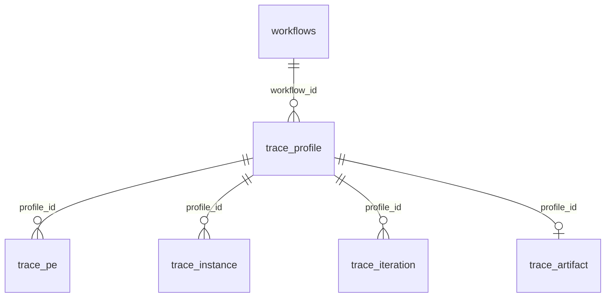

# Laminar trace storage in the registry

This document describes the trace schema owned by `dispel4py-server`, the information saved by `trace_run`, and how to inspect it. The SQL migration is the source of truth for exact types, keys, and constraints: [`../src/main/resources/db/trace_schema.sql`](../src/main/resources/db/trace_schema.sql). The client command, examples, and HTTP client API are documented in the client repository and the Laminar 3 wiki.

## One configuration, one current result

Every trace belongs to an existing registered workflow. `trace_profile` identifies a configuration with exactly these four fields:

```sql
UNIQUE (workflow_id, mapping, num_processes, engine_id)
```

`mapping` is `simple`, `multi`, or `mpi`; `num_processes` is the **requested** process budget, which can differ from the actual number of allocated PE instances and hosting processes. `engine_id` is the configured execution engine's ID; engine URLs come from server configuration rather than an engine table.

The same workflow can therefore have separate simple, multi, MPI, process-count, and engine profiles. A completed run with an existing key retains the profile ID, assigns a new `run_id`, and replaces that profile's metrics and ZIP in one database transaction. It does **not** retain a history of earlier successful results under the same key. A failed replacement releases its lease and records `last_error` while leaving the last completed metrics and ZIP available. Concurrent work on the same key is rejected while its lease is active; the lease token prevents a stale worker from replacing a newer run. `completed_at` is null until a profile has a successful result; searches return completed profiles.

Inputs, resource hashes, sampling interval, software versions, and source hashes are recorded for interpretation but **are not part of the unique key**. Reusing the same configuration with different inputs overwrites its previous successful result. Compare configurations only with equivalent inputs and measurement settings.

## Tables and relationships

All new tables are additive to the existing registry. The migration runs during server startup after the existing workflow schema is initialized; existing workflow, user, and PE tables are not changed.

| Table | Primary key and link | Stored data |
|---|---|---|
| `trace_profile` | `id`; `workflow_id` references `workflows.workflow_id` | Configuration, last successful `run_id`, `submitted_by`, start/completion timestamps, total engine subprocess elapsed seconds, JSON metadata, lease and last error. A unique constraint covers workflow, mapping, requested processes, and engine. |
| `trace_pe` | `(profile_id, pe_id)`; `profile_id` references `trace_profile.id` | One row per runtime PE: call count, accumulated processing-call time, local CPU time, maximum observed hosting-process RSS, and its complete exported summary row in `metrics_json`. |
| `trace_instance` | `(profile_id, instance_id)`; `profile_id` references `trace_profile.id` | One row per allocated runtime PE instance, including instances with zero calls: parent runtime `pe_id`, rank, count, processing-call time, CPU, RSS and complete exported instance row in `metrics_json`. |
| `trace_iteration` | `(profile_id, iteration_row)`; `profile_id` references `trace_profile.id` | One row for each successful monitored `PE.process` call: PE and instance identifiers, instance-local iteration index, call elapsed/CPU time, observed peak RSS and the full exported row in `metrics_json`. `iteration_row` gives stable pagination order within a profile. |
| `trace_artifact` | `profile_id` is both primary and foreign key to `trace_profile.id` | `content_zip LONGBLOB`, the complete compressed trace artifact for the current successful run. |

Deleting a registered workflow cascades to its trace profiles; deleting a profile cascades to its child metrics and ZIP. `pe_id` is a runtime label such as `RunLengthEncodePE53`. It is **not** a foreign key to the registry's numeric PE ID. `instance_id` is a runtime label such as `RunLengthEncodePE53@2`. The PE label, instance label, and rank let queries aggregate or distinguish replicas, but this schema does not store Python class name, custom `pe.name`, or registry PE ID as separate fields.

Typical relationships:



The graph edges and nodes are contained in the artifact ZIP. They are **not** individual SQL rows. Use the graph JSON in the ZIP if you need connectivity; a future SQL feature for querying edges would require extracting and indexing that JSON.

## What the ZIP retains

The archive includes the files exported by the monitored execution. File names include the run ID and vary with mapping, number of instances, and whether graph figures were requested.

| Artifact | Contents |
|---|---|
| `monitoring/monitor_shape_run<run_id>.json` | Abstract runtime graph: PE identifiers, directed edges, input/output connection names, and topological order. |
| `monitoring/monitor_concrete_shape_run<run_id>.json` | Allocated instance graph: instance-to-PE/rank mapping, process allocation, possible instance connections, and order. This represents the allocated graph; edges do not themselves measure per-message traffic. |
| `monitoring/monitor_summary_run<run_id>.csv` | Full summary for each runtime PE, including timing distribution, counts, CPU, RSS, ranks, and process identifiers. |
| `monitoring/monitor_instances_run<run_id>.csv` | Full summary for each instance, including allocated instances that processed zero calls. |
| `monitoring/monitor_iteration_timings_run<run_id>.csv` | A merged row per successful monitored processing call, with instance, rank, host/PID, timing, CPU, and sampled RSS fields. |
| Other `monitoring/*.csv` and `monitoring/monitor_resources_run<run_id>.json` | Per-rank and latency exports, measurement scope, sampling interval, and resource metric definitions. |
| `trace_metadata.json`, `trace_workflow_source.py`, `trace_workflow.cloudpickle`, `trace_input.cloudpickle`, `stdout.log` | Environment and source/input hashes, workflow source and serialized workflow/input, and captured stdout/stderr. Treat serialized files as executable Python data and only deserialize trusted content. |

Uploaded resource names, sizes, and hashes are recorded; the resource file bytes are not duplicated in the ZIP. Optional graph PNGs require `--graph-figures`. The archive is subject to the execution service's size limits; an oversized or incomplete export fails the trace rather than storing a partial success.

## Worked example: workflow 47

These profile IDs and run IDs were observed through `trace_show 47` during the run-length encoding smoke checks. They are a worked example, **not** a fresh direct SQL dump of the user's registry.

| `trace_profile.id` | Workflow | Mapping | Requested processes | Engine | Last observed `run_id` |
|---:|---:|---|---:|---|---|
| 1 | 47 | `simple` | 1 | `default` | `74c682e36fea47a88d5b2cc15ab4c283` |
| 2 | 47 | `multi` | 3 | `default` | `7bf2cfcde21b4c1d9e91455879f8fe19` |
| 3 | 47 | `multi` | 10 | `default` | `a1311679aad74c0d905546fc065fa8b1` |

In the 10-process profile, the allocator actually produced **nine** instances: `InputStringPE52@0`, four `RunLengthEncodePE53` instances at ranks 1–4, and four `CollectEncodedPE54` instances at ranks 5–8. Two instances had zero calls. Each of the three PEs had **three calls** because three input strings passed through each PE; calls are records processed, not the number of processes. The empty string is an input record too. At this scale the timings are too short for meaningful speed comparisons.

## Inspect the live MySQL registry

From the server repository on the Docker host, use its configured database credentials. With the supplied MySQL Compose service:

```bash
cd ~/Research/StreamFlow/dispel4py-server
docker compose exec mysql sh -lc 'mysql -u root -p"$MYSQL_ROOT_PASSWORD" laminar'
```

At the `mysql>` prompt:

```sql
SHOW TABLES LIKE 'trace_%';
SHOW CREATE TABLE trace_profile\G
SHOW CREATE TABLE trace_instance\G

SELECT id, workflow_id, mapping, num_processes, engine_id,
       run_id, submitted_by, completed_at, wall_seconds
FROM trace_profile
WHERE workflow_id = 47
ORDER BY id;

SELECT pe_id, total_count, total_seconds, cpu_seconds, rss_max_bytes
FROM trace_pe
WHERE profile_id = 3
ORDER BY pe_id;

SELECT instance_id, pe_id, rank_label, total_count, total_seconds,
       cpu_seconds, rss_max_bytes
FROM trace_instance
WHERE profile_id = 3
ORDER BY pe_id, rank_label;

SELECT iteration_row, pe_id, instance_id, iteration_index,
       elapsed_seconds, cpu_seconds, rss_peak_bytes
FROM trace_iteration
WHERE profile_id = 3
ORDER BY iteration_row
LIMIT 20;

SELECT profile_id, OCTET_LENGTH(content_zip) AS compressed_bytes
FROM trace_artifact
WHERE profile_id IN (1, 2, 3)
ORDER BY profile_id;
```

The JSON columns hold fields beyond those selected here. For example:

```sql
SELECT id, JSON_EXTRACT(metadata_json, '$.memory_sampling_interval_secs')
FROM trace_profile WHERE workflow_id = 47;

SELECT instance_id, metrics_json
FROM trace_instance WHERE profile_id = 3 LIMIT 1;
```

The first JSON path is only an example: consult `trace_metadata.json` or `metadata_json` for the exact keys emitted by your installed engine version. Use the authenticated `trace_show` command or `download_trace` client API to retrieve the ZIP; there is no need to transfer a `LONGBLOB` manually from SQL.

```text
trace_show 47
trace_show 47 --mapping multi -n 10 --engine default
trace_show 47 --mapping multi -n 10 --download-directory saved_traces
```

These queries show **the currently retained result per configuration**. For the complete DDL, including precise column types, indexes, and foreign-key rules, read `src/main/resources/db/trace_schema.sql` in this repository.

## Meaning and limits of the measurements

`total_seconds` is the sum of successful processing-call durations for that PE or instance. Parallel calls can overlap, so summed PE time is not workflow elapsed time. `wall_seconds` on the profile includes engine subprocess startup, execution, and monitoring export; it excludes client/server transfer and database storage. The local process CPU measurement can include threads. RSS is observed **hosting-process** resident memory during calls: several PEs can share one process, so do not add their RSS figures together or treat a PE's RSS as its exclusive allocation. RSS sampling can miss short peaks.

The exporter measures successful `PE.process` calls. PE setup/finalization, external services and LLMs, remote CPU/GPU use, queue waiting, and per-message traffic are not fully attributed by these measurements. `trace_iteration` holds call summaries rather than continuous CPU/RSS time series. The user-facing terminal report is a digest of these recorded facts; it does not run an LLM to generate conclusions.

## Where the related documentation belongs

- **Server (this document):** `dispel4py-server/docs/TRACE_STORAGE.md` owns the database layout, overwrite rules, graph/archive contents, and SQL inspection commands. Link it from the server `README.md`.
- **Client:** `dispel4py-client/docs/TRACE_API.md` owns CLI and Python API usage. The Laminar wiki provides worked examples and links to both references.
- **Execution engine / dispel4py:** document exporter CSV/JSON fields and measurement semantics alongside the exporter in those repositories. Link back here for registry persistence; avoid duplicating database definitions there.

When the schema changes, update the SQL migration and this document together. Keep examples labelled as observed results unless they are generated from a live database query.
